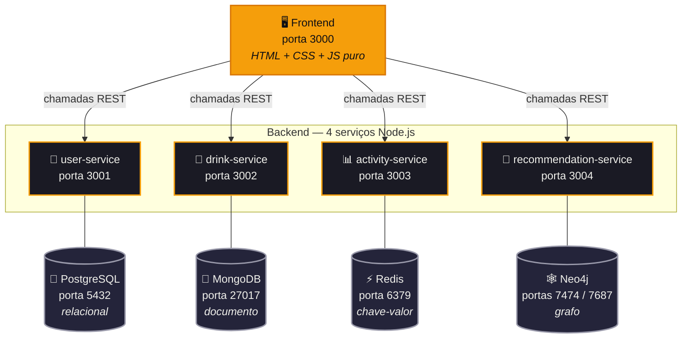

# 🍹 DrinkDex — Catálogo de Drinks e Coquetéis

> Projeto da disciplina **Tuning de Dados** — Polyglot Persistence
> Fundação Educacional Inaciana Padre Sabóia de Medeiros (FEI)


---

## 👥 Integrantes

| Nome | RA |
|------|----|
| Heron de Souza | 22.223.009-6 |
| João Mateus E. B. da Silva | 22.223.013-8 |
| Matheus Concon | 22.124.089-8 |
| Dante Ryuichi Kawazu | 22.125.083.0 |

---

## Sobre o projeto

O DrinkDex é um catalogo de drinks e coquetéis onde o usuario pode se cadastrar, explorar receitas, favoritar bebidas e ver quais drinks estão sendo mais acessados em tempo real.

A ideia principal do projeto é demonstrar o conceito de **Polyglot Persistence**, que basicamente é usar o banco de dados mais adequado pra cada tipo de dado, em vez de enfiar tudo num banco só. Cada banco tem um ponto forte e a gente tentou aproveitar isso:

- Dados de usuario sao bem estruturados e precisam de consistencia → **PostgreSQL** (relacional)
- Receitas de drinks variam muito entre si (ingredientes, modo de preparo, etc) → **MongoDB** (documento)
- Rankings e favoritos precisam ser rapidos e nao precisam de persistencia forte → **Redis** (chave-valor em memoria)
- Recomendacoes baseadas em ingredientes compartilhados sao naturalmente um grafo → **Neo4j** (grafo)

---

## Arquitetura



---

## Escolha dos Bancos de Dados

### PostgreSQL — dados de usuario

Usuarios tem nome, email, senha, data de cadastro — tudo muito bem definido e que nao muda. Alem disso, a gente precisa garantir que dois usuarios nao tenham o mesmo email, o que é exatamente o tipo de coisa que um banco relacional faz bem com constraints. Escolhemos o PostgreSQL pela robustez e suporte completo a ACID.

### MongoDB — receitas de drinks

Cada drink é diferente. Um tem 3 ingredientes, outro tem 10. Um tem foto, outro nao tem. Tentar modelar isso numa tabela relacional seria bem complicado (varias tabelas, varios joins). No MongoDB a gente só cria um documento com o que precisar e pronto. Tambem usamos o indice de texto do mongo pra fazer busca por nome e ingredientes.

### Redis — ranking, favoritos e historico

Pra saber quais drinks estao sendo mais acessados em tempo real, precisamos de algo extremamente rapido. O Redis tem uma estrutura chamada **Sorted Set** que é perfeita pra isso — cada drink tem um "score" que a gente incrementa a cada visualizacao e dai pede os top 10. Pra favoritos usamos **Set** (sem duplicatas automatico) e pra historico usamos **List** (ordenada por insercao).

### Neo4j — recomendacoes por ingredientes

Recomendar drinks similares ("se voce gostou de Mojito, talvez goste de Daiquiri") é um problema classicamente resolvido com **grafos**. Cada drink vira um no, cada ingrediente vira um no, e a gente cria a relacao `(Drink)-[:CONTEM]->(Ingrediente)`. Pra recomendar drinks parecidos basta uma travessia de grafo: "quais outros drinks compartilham mais ingredientes com este?".

Fazer isso no PostgreSQL exigiria varios JOINs em tabelas de drinks, ingredientes e relacionamentos, e a query ficaria pesada. No Mongo, daria pra fazer com `$lookup` mas perderia a expressividade. No Neo4j a consulta é uma linha de **Cypher**:

```cypher
MATCH (origem:Drink {id: $id})-[:CONTEM]->(i)<-[:CONTEM]-(outro:Drink)
RETURN outro, count(i) AS ingredientesEmComum
ORDER BY ingredientesEmComum DESC
```

Outra vantagem é que o Neo4j vem com uma **interface web em http://localhost:7474** onde da pra visualizar o grafo renderizado — otimo pra mostrar como os drinks estao conectados pelos ingredientes durante a apresentacao.

---

## Estrutura de pastas

```
drinkdex/
├── docker-compose.yml
├── servicos/
│   ├── servico-usuarios/        → Node.js + PostgreSQL
│   │   ├── Dockerfile
│   │   ├── package.json
│   │   └── index.js
│   ├── servico-drinks/          → Node.js + MongoDB
│   │   ├── Dockerfile
│   │   ├── package.json
│   │   ├── index.js
│   │   └── seed.js              → popula o banco com drinks de exemplo
│   ├── servico-atividades/      → Node.js + Redis
│   │   ├── Dockerfile
│   │   ├── package.json
│   │   └── index.js
│   └── servico-recomendacoes/   → Node.js + Neo4j
│       ├── Dockerfile
│       ├── package.json
│       └── index.js
└── frontend/
    ├── Dockerfile
    └── public/
        ├── index.html
        ├── style.css
        └── app.js
```

---

## Como executar

### 1. Habilitar o Hyper-V (Windows 11 Pro)

O Docker usa o Hyper-V pra criar os containers. No Windows 11 Pro ele ja vem disponivel mas precisa ser ativado.

Abra o PowerShell como **Administrador** e rode:

```powershell
dism.exe /online /enable-feature /featurename:Microsoft-Hyper-V /all /norestart
dism.exe /online /enable-feature /featurename:VirtualMachinePlatform /all /norestart
```

Depois **reinicie o computador**. Isso é obrigatorio, sem reiniciar o Hyper-V nao ativa.

---

### 2. Instalar o Docker Desktop

Baixe o instalador em: **https://www.docker.com/products/docker-desktop**

Durante a instalacao, deixe marcada a opcao **"Use WSL 2 instead of Hyper-V"** desmarcada — no Pro a gente usa Hyper-V mesmo.

Apos instalar, abra o Docker Desktop e aguarde o icone na barra de tarefas ficar verde. Isso significa que o engine ta rodando.

Pra confirmar que funcionou, abra o PowerShell e rode:

```powershell
docker --version
```

Se aparecer algo como `Docker version 27.x.x` ta tudo certo.

---

### 3. Clonar ou baixar o repositorio

Se tiver git instalado:

```bash
git clone https://github.com/Herondsx/drinkdex-performance-e-tunning-de-dados
cd drinkdex
```

Ou baixe o .zip pelo GitHub e extraia a pasta normalmente.

---

### 4. Subir todos os servicos

Com o Docker Desktop aberto e rodando, abra o terminal **dentro da pasta do projeto** (onde esta o `docker-compose.yml`) e rode:

```bash
docker compose up --build
```

Na primeira vez demora mais pq ele baixa as imagens do PostgreSQL, MongoDB, Redis, Neo4j e Node. Das proximas vezes é bem mais rapido.

Quando aparecer no terminal algo como `frontend`, `user-service`, `drink-service`, `activity-service` e `recommendation-service` todos com "rodando na porta...", ta pronto.

> **Atencao com o Neo4j:** ele demora uns ~30 segundos a mais que os outros pra ficar pronto. Se o `recommendation-service` reiniciar algumas vezes nos primeiros segundos, é normal — ele esta esperando o Neo4j subir.

---

### 5. Popular o banco com drinks de exemplo

Abre outro terminal (com os containers ainda rodando) e execute:

```bash
docker compose exec drink-service npm run seed
```

Isso insere 10 drinks classicos (Mojito, Caipirinha, Margarita, Old Fashioned, etc.) pra ja ter conteudo na hora de abrir o sistema. Logo depois de inserir, o seed avisa automaticamente o `recommendation-service` pra **construir o grafo de ingredientes no Neo4j**, entao as recomendacoes ja saem prontas.

> Se quiser refazer o grafo manualmente em algum momento:
> ```bash
> curl -X POST http://localhost:3004/sync
> ```

---

### 6. Acessar a aplicacao

| O que é | Endereço |
|---------|---------|
| **Frontend (interface)** | http://localhost:3000 |
| API de Usuarios | http://localhost:3001 |
| API de Drinks | http://localhost:3002 |
| API de Atividades | http://localhost:3003 |
| API de Recomendacoes | http://localhost:3004 |
| **Neo4j Browser** (visualiza o grafo) | http://localhost:7474 |

Abra o http://localhost:3000 no navegador e o sistema ja deve estar funcionando.

> **Dica pra apresentacao:** abra tambem o http://localhost:7474 num segunda aba. Logue com usuario `neo4j` e senha `drinkdex123` e rode no console:
> ```cypher
> MATCH (d:Drink)-[:CONTEM]->(i:Ingrediente) RETURN d, i
> ```
> Vai aparecer o grafo inteiro renderizado em forma visual, mostrando como os drinks compartilham ingredientes. Da pra mexer, arrastar e zoom — fica bem demonstrativo.

---

### Parar os containers

```bash
docker compose down
```

Os dados ficam salvos nos volumes do Docker, entao na proxima vez que subir com `docker compose up` tudo continua como estava.

---

## Endpoints principais

### User Service (3001)

| Metodo | Rota | O que faz |
|--------|------|-----------|
| POST | `/register` | Cadastra novo usuario |
| POST | `/login` | Faz login e retorna token JWT |
| GET | `/users` | Lista todos os usuarios |
| GET | `/users/:id` | Busca usuario por ID |
| PUT | `/users/:id` | Atualiza nome ou email |
| DELETE | `/users/:id` | Remove usuario |

### Drink Service (3002)

| Metodo | Rota | O que faz |
|--------|------|-----------|
| GET | `/drinks` | Lista drinks (aceita `?q=busca` e `?category=tipo`) |
| GET | `/drinks/:id` | Busca drink pelo ID |
| POST | `/drinks` | Cadastra novo drink |
| PUT | `/drinks/:id` | Atualiza drink |
| DELETE | `/drinks/:id` | Remove drink |

### Activity Service (3003)

| Metodo | Rota | O que faz |
|--------|------|-----------|
| POST | `/view/:drinkId` | Registra que alguem visualizou o drink |
| GET | `/ranking` | Retorna top 10 mais acessados |
| POST | `/favorites/:userId/:drinkId` | Adiciona nos favoritos |
| DELETE | `/favorites/:userId/:drinkId` | Remove dos favoritos |
| GET | `/favorites/:userId` | Lista favoritos do usuario |
| GET | `/history/:userId` | Historico de visualizacoes |

### Recommendation Service (3004)

| Metodo | Rota | O que faz | Operacao CRUD |
|--------|------|-----------|---------------|
| POST | `/ingredientes/:drinkId/:ingrediente` | Adiciona um ingrediente a um drink no grafo | **Create** |
| GET | `/drinks/:drinkId/ingredientes` | Lista os ingredientes de um drink no grafo | **Read** |
| PUT | `/ingredientes/:antigo/:novo` | Renomeia um ingrediente em todos os drinks | **Update** |
| DELETE | `/ingredientes/:drinkId/:ingrediente` | Remove a relacao entre drink e ingrediente | **Delete** |
| POST | `/sync` | Recria o grafo todo a partir dos drinks no MongoDB | (bulk write) |
| GET | `/similares/:drinkId` | Top 5 drinks com mais ingredientes em comum | (consulta de grafo) |
| GET | `/ingredientes/populares` | Top 10 ingredientes mais usados entre todos os drinks | (agregacao) |

---

## Roteiro de demonstracao do CRUD (para apresentacao)

O projeto faz CRUD completo nos 4 bancos. Aqui esta o roteiro pra demonstrar cada um na hora da apresentacao:

### 1. PostgreSQL — CRUD de usuarios (via frontend)
- **Create:** clica em "Cadastrar" → preenche nome/email/senha → cria conta
- **Read:** faz login → o sistema busca o usuario no Postgres
- **Update:** (via API) `PUT http://localhost:3001/users/:id` com novo nome/email
- **Delete:** (via API) `DELETE http://localhost:3001/users/:id`

### 2. MongoDB — CRUD de drinks (via frontend)
- **Create:** logado, clica em "+ Novo Drink" → preenche o formulario → salva
- **Read:** pagina inicial ja lista os drinks; clica em qualquer um pra ver detalhes
- **Update:** na pagina do drink, clica em "✏️ Editar" → altera algo → salva
- **Delete:** na pagina do drink, clica em "🗑️ Excluir"

### 3. Redis — CRUD de atividades (via frontend)
- **Create:** clica em qualquer drink (registra view e incrementa o ranking) e em "♡ Favoritar"
- **Read:** menu "Favoritos" e "Historico"; pagina inicial mostra o ranking
- **Update:** clicar varias vezes em drinks diferentes atualiza o ranking em tempo real
- **Delete:** clicar em "♥ Favoritado" remove dos favoritos

### 4. Neo4j — CRUD do grafo de ingredientes (via terminal + Neo4j Browser)

**Antes de tudo,** abra o Neo4j Browser em http://localhost:7474, logue com `neo4j` / `drinkdex123` e rode:

```cypher
MATCH (d:Drink)-[:CONTEM]->(i:Ingrediente) RETURN d, i
```

Vai aparecer o grafo inteiro com todos os drinks ligados aos ingredientes. Deixe essa aba aberta — toda vez que voce fizer uma operacao, **basta clicar em "Run" de novo pra ver o grafo atualizado em tempo real**. Isso é o ponto alto da apresentacao!

Pra pegar o ID de um drink pra testar, no terminal:

```powershell
curl http://localhost:3002/drinks
```

Copie um `_id` qualquer. Vou usar `<DRINK_ID>` como placeholder nos comandos abaixo.

**Create** — adicionar "gelo" como ingrediente de um drink:
```powershell
curl -X POST http://localhost:3004/ingredientes/<DRINK_ID>/gelo
```

**Read** — ver os ingredientes desse drink no grafo:
```powershell
curl http://localhost:3004/drinks/<DRINK_ID>/ingredientes
```

**Update** — renomear "gelo" pra "gelo picado" em TODOS os drinks:
```powershell
curl -X PUT http://localhost:3004/ingredientes/gelo/gelo%20picado
```

> 💡 Note que `%20` é o espaco em URL. Esse comando mostra o poder do grafo: **um unico no de ingrediente é compartilhado por varios drinks**, entao renomear afeta todos de uma vez.

**Delete** — remover a relacao entre o drink e o ingrediente:
```powershell
curl -X DELETE http://localhost:3004/ingredientes/<DRINK_ID>/gelo%20picado
```

Depois de cada comando, volte no Neo4j Browser e clique em "Run" de novo na query inicial. Voce vai ver o grafo se transformando em tempo real — adicionando nos, renomeando, removendo conexoes.

